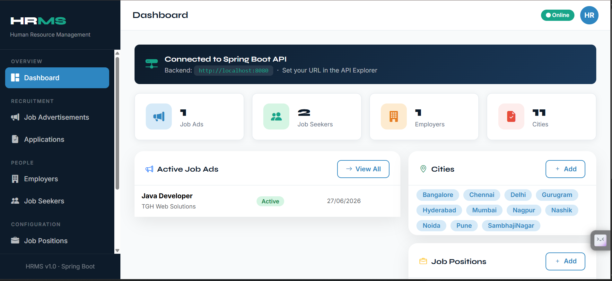
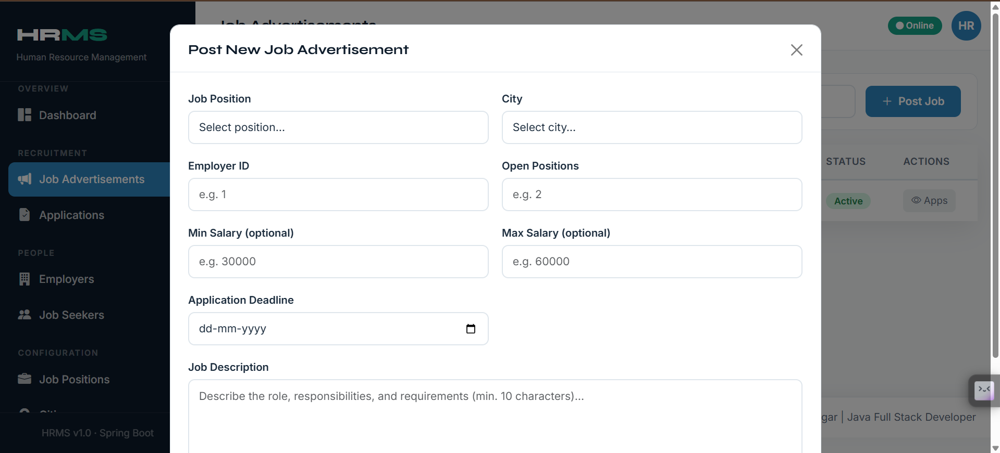
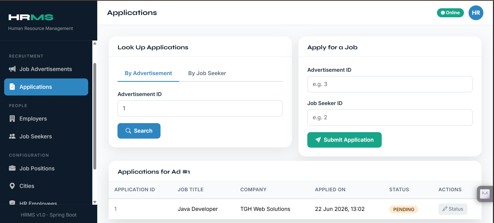
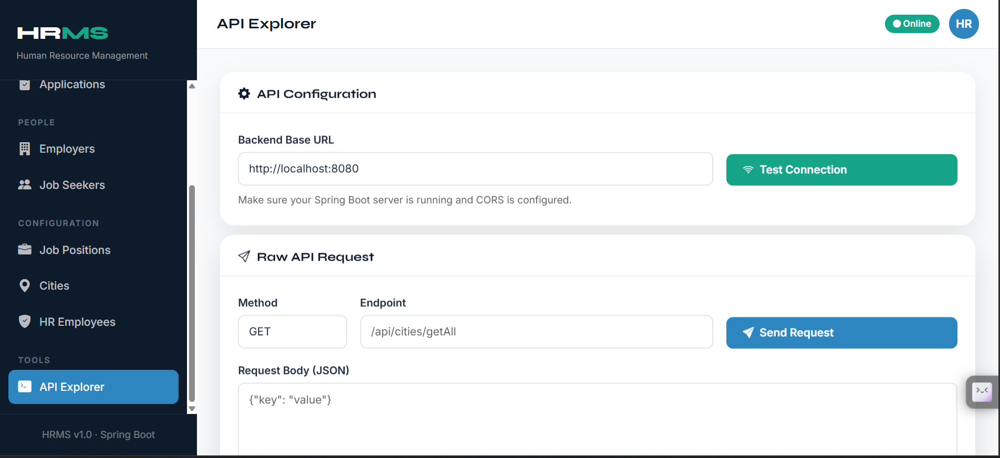
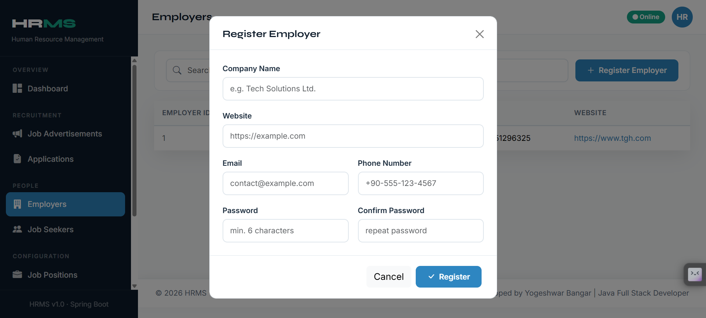
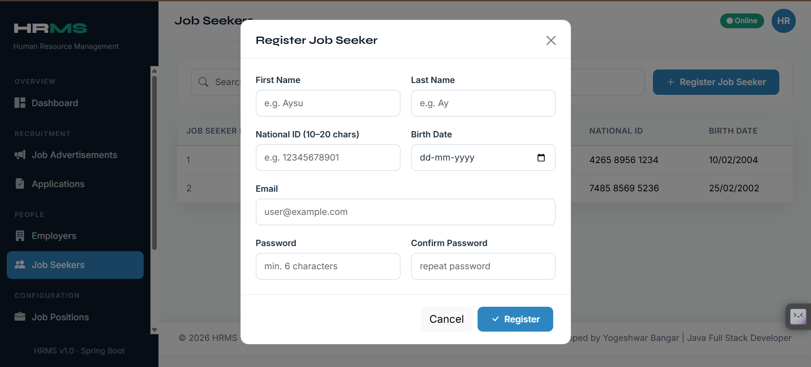

# Human Resource Management System (HRMS)

A full-stack Human Resource Management System (HRMS) built using **Java Spring Boot**, **Hibernate/JPA**, **MySQL**, **HTML**, **CSS**, **JavaScript**, and **Bootstrap**.

The application provides a modern dashboard for managing job advertisements, employers, job seekers, applications, cities, job positions, and HR employees.
---

## 🚀 Features
### 📊 Dashboard
* Real-time statistics
* Active job advertisements
* Cities and job positions overview
* Automatic data refresh

### 💼 Job Advertisements
* Create and manage job postings
* View active/inactive advertisements
* Search and filter advertisements
* Track applications for each job

### 👥 Employers Management
* Register employers
* View employer details
* Company website integration

### 🧑‍💻 Job Seekers Management
* Register candidates
* Manage job seeker profiles
* Search functionality

### 📝 Job Applications
* Apply for jobs
* View applications by advertisement
* View applications by job seeker
* Update application status

### ⚙️ Configuration
* Manage cities
* Manage job positions
* Manage HR employees

### 🔌 API Explorer
* Configure backend URL
* Test API endpoints
* Send custom API requests
* View JSON responses
---

# 🛠️ Technologies Used
## Backend
* Java 21
* Spring Boot
* Spring MVC
* Spring Data JPA
* Hibernate
* Maven
* MySQL

## Frontend
* HTML5
* CSS3
* JavaScript (ES6)
* Bootstrap 5
* Bootstrap Icons

## Tools
* Eclipse IDE
* Postman
* Git
* GitHub
* MySQL Workbench
---

# 📁 Project Structure
--text
hrms/
│
├── backend/
│   ├── controller/
│   ├── service/
│   ├── repository/
│   ├── entity/
│   ├── dto/
│   └── config/
│
├── frontend/
│   ├── index.html
│   ├── css/
│   │    └── style.css
│   └── js/
│        └── script.js
│
└── README.md

---

# ⚙️ Prerequisites
Before running the project, install:
* Java JDK 21
* Maven
* MySQL Server
* Eclipse IDE or IntelliJ IDEA
* Git
---

# 🗄️ Database Configuration
Create a database:
--SQL
CREATE DATABASE hrms;

Update application.properties:
-- properties
spring.datasource.url=jdbc:mysql://localhost:3306/hrms
spring.datasource.username=root
spring.datasource.password=your_password

spring.jpa.hibernate.ddl-auto=update
spring.jpa.show-sql=true
---

# ▶️ Running the Backend

Clone the repository:
git clone https://github.com/yourusername/hrms.git

Navigate to the project:
cd hrms

Run the application:
mvn spring-boot:run

Backend will start on:
http://localhost:8080
---

# 🌐 Running the Frontend
Simply open:
frontend/index.html

Or deploy the frontend using:

* Apache Tomcat
* Spring Boot Static Resources
* VS Code Live Server
---

# 🔗 API Endpoints

## Job Advertisements
GET    /api/jobPost/getAll
POST   /api/jobPost/add

## Employers
GET    /api/employers/getAll
POST   /api/employers/register

## Job Seekers
GET    /api/candidateController/getAll
POST   /api/candidateController/register

## Cities
GET    /api/cities/getAll
POST   /api/cities/add

## Job Positions
GET    /api/jobPosition/getAll
POST   /api/jobPosition/add

## Applications
POST   /api/applications/apply
GET    /api/applications/by-advertisement/{id}
GET    /api/applications/by-jobseeker/{id}
POST   /api/applications/update-status

---

# ✨ Features Implemented

* Responsive UI
* Dashboard Statistics
* CRUD Operations
* Search and Filtering
* API Explorer
* Toast Notifications
* Form Validation
* Automatic Data Refresh
* Modern Admin Dashboard Design
---

# 📸 Screenshots
## 📸 Screenshots

### Dashboard

### Advertisement

### Applications

### API Explorer

### Employers Page

### Job Seekers Page

---

# 🔮 Future Enhancements
* JWT Authentication
* Role-Based Authorization
* Email Notifications
* Resume Upload
* Reports and Analytics
* Charts and Graphs
* Dark Mode
* Docker Deployment
---

# 👨‍💻 Author
**Yogeshwar Bangar**
*Java Full Stack Developer*
* Java
* Spring Boot
* Hibernate
* MySQL
* HTML/CSS/JavaScript
* React

